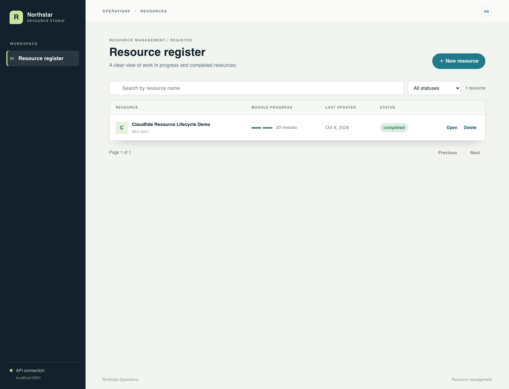
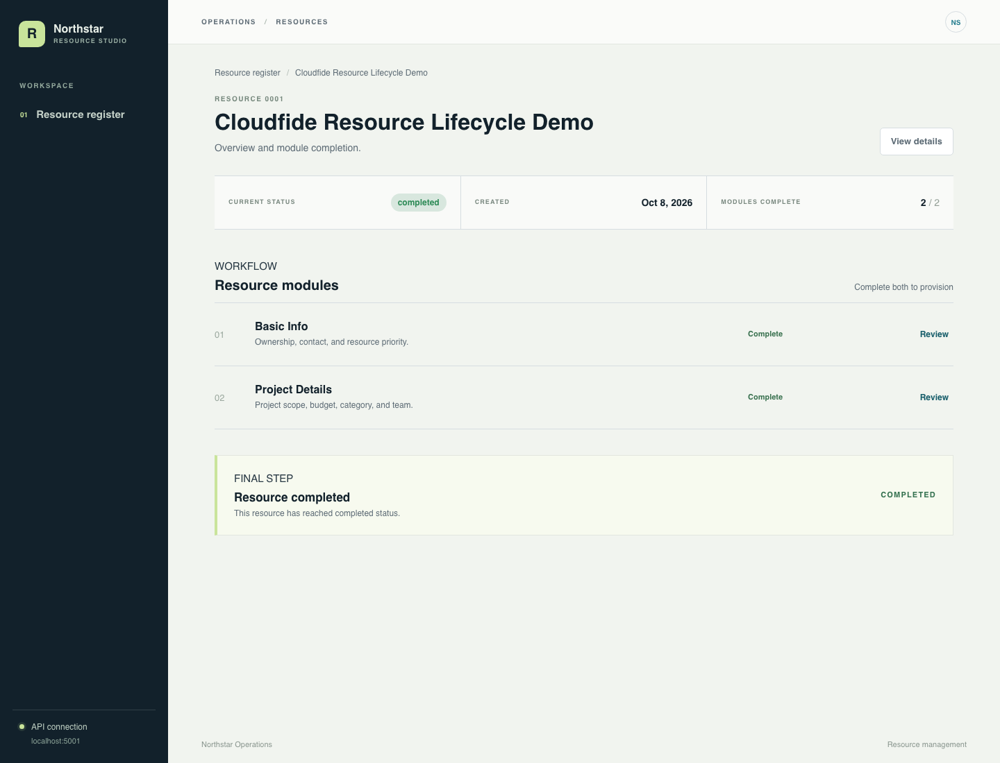
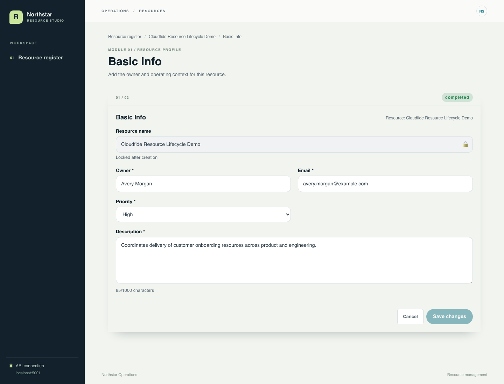
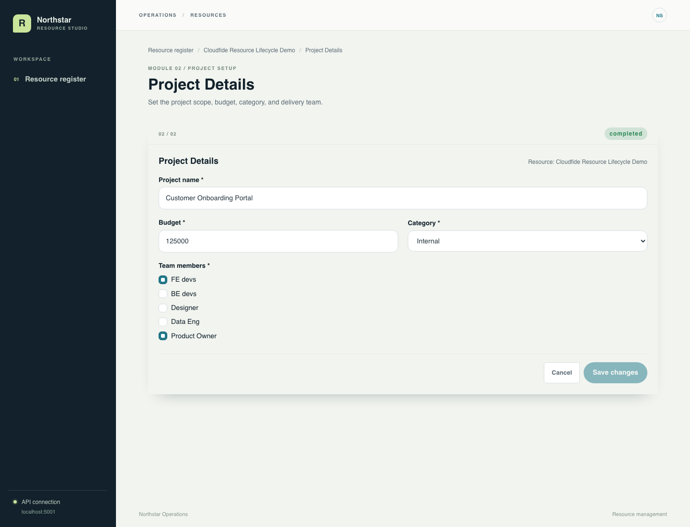
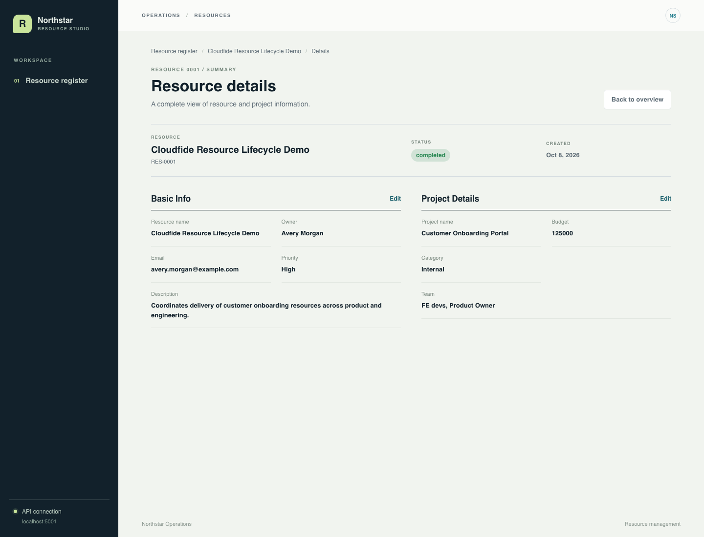
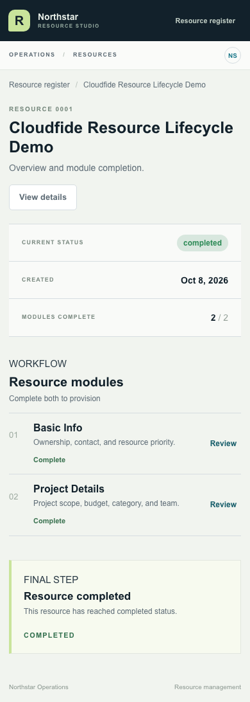
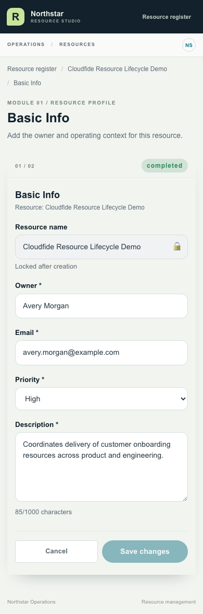
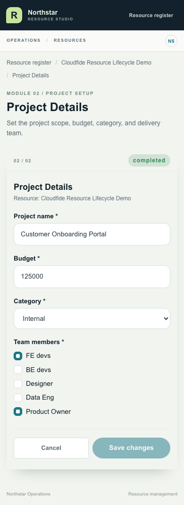
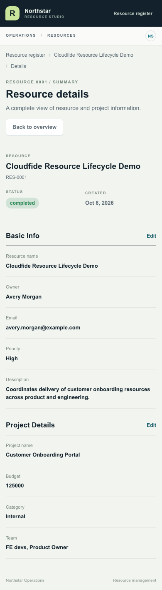

# Modular Form Creator

A resource management application for creating, tracking, and completing resources through a two-module workflow.

## Preview

The app provides a resource register, a two-step module workflow, provisioning, and a read-only details summary.

### Resource register



### Resource workflow

The overview tracks module progress and shows when a resource is ready for provisioning or has been completed.



### Module forms





### Resource summary



### Mobile views

These screenshots show the responsive completed overview, both module forms, and details summary.









## Stack

- Frontend: React, TypeScript, Vite, and styled-components
- Backend: Express, TypeScript, and MongoDB

## Run the full application

```sh
docker compose up -d --build
```

Open the application at <http://localhost:5173/resources>.

- API: <http://localhost:5001>
- API documentation: <http://localhost:5001/docs>

The MongoDB data is stored in the `mongo_data` Docker volume. Stop the services with:

```sh
docker compose down
```

To also delete the stored database data, use `docker compose down -v`.

## Checks

Install frontend dependencies and run the project checks with:

```sh
npm ci
npm run lint
npm run build
npm test
```
